# Programming Implementation On NodeMCU LED

## Mikrokontroler
Mikrokontroler adalah suatu chip berupa IC (Integrated Circuit) yang dapat menerima sinyal input, mengolahnya dan memberikan sinyal output sesuai dengan program yang diisikan ke dalamnya. Sinyal input mikrokontroler berasal dari sensor yang merupakan informasi dari lingkungan sedangkan sinyal output ditujukan kepada aktuator yang dapat memberikan efek ke lingkungan. Jadi secara sederhana mikrokontroler dapat diibaratkan sebagai otak dari suatu perangkat/produk yang mempu berinteraksi dengan lingkungan sekitarnya. 

Mikrokontroler pada dasarnya adalah komputer dalam satu chip, yang di dalamnya terdapat mikroprosesor, memori, jalur Input/Output (I/O) dan perangkat pelengkap lainnya. Kecepatan pengolahan data pada mikrokontroler lebih rendah jika dibandingkan dengan PC. Pada PC kecepatan mikroprosesor yang digunakan saat ini telah mencapai orde GHz, sedangkan kecepatan operasi mikrokontroler pada umumnya berkisar antara 1 – 16 MHz. Begitu juga kapasitas RAM dan ROM pada PC yang bisa mencapai orde Gbyte, dibandingkan dengan mikrokontroler yang hanya berkisar pada orde byte/Kbyte.

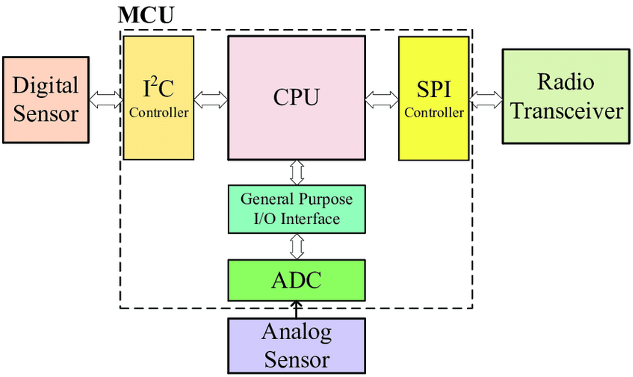

Block Diagram MCU

Sistem yang menggunakan mikrokontroler sering disebut sebagai embedded system atau dedicated system. Embeded system adalah sistem pengendali yang tertanam pada suatu produk, sedangkan dedicated system adalah sistem pengendali yang dimaksudkan hanya untuk suatu fungsi tertentu. Sebagai contoh, printer adalah suatu embedded system karena di dalamnya terdapat mikrokontroler sebagai pengendali dan juga dedicated system karena fungsi pengendali tersebut berfungsi hanya untuk menerima data dan mencetaknya. Hal ini berbeda dengan suatu PC yang dapat digunakan untuk berbagai macam keperluan, sehingga mikroprosesor pada PC sering disebut sebagai general purpose microprocessor (mikroprosesor serba guna). Pada PC berbagai macam software yang disimpan pada media penyimpanan dapat dijalankan, tidak seperti mikrokontroler hanya terdapat satu software aplikasi. Penggunaan mikrokontroler antara lain terdapat pada bidang-bidang berikut ini:
1. Otomotif : Engine Control Unit, Air Bag, fuel control, Antilock Braking System, sistem pengaman alarm, transmisi automatik, hiburan, pengkondisi udara, speedometer dan odometer, navigasi, suspensi aktif.
2. perlengkapan rumah tangga dan perkantoran : sistem pengaman alarm, remote control, mesin cuci, microwave, pengkondisi udara, timbangan digital, mesin foto kopi, printer, mouse.
3. pengendali peralatan di industri.
4. robotika. 

selain itu ada banyak jenis board microcontroller yang dapat digunakan dalam pengembangan project Internet of Things, salah satu jenis board yang umum dipakai adalah Arduino dan NodeMCU.

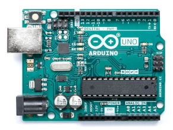

Arduino UNO

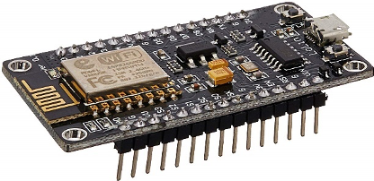

NodeMCU

## NodeMCU Development Board
NodeMCU adalah mikrokontroller yang dibuat berdasarkan chip WiFi ESP8266, jadi NodeMCU adalah seperti arduino biasa yang dapat di flash instruksi tertentu sesuai dengan keinginan kita namun memiliki fitur WiFi, sehingga dapat berinteraksi dengan perangkat client jaringan atau bahkan dengan internet. 

NodeMCU juga merupakan development board yang juga menyediakan firmware berbasis eLua untuk chip WiFi ESP8266 dari vendor Espressif. Firmwarenya berbasis Espressif NON-OS SDK dan menggunakan file system berbasis spiffs. Repositori kodenya sendiri berisi 98.1% C-code. Firmware NodeMCU adalah projek pendukung dari development kit NodeMCU yang sangat populer, yang juga menyertakan development board open-source siap pakai yang menggunakan chip ESP8266-12E.

Pemrograman NodeMCU dapat dilakukan dengan mudah sebagaimana menggunakan Arduino. Perbedaan utamanya adalah pada bagian penomeran pin dari boardnya, seperti terlihat pada gambar berikut:

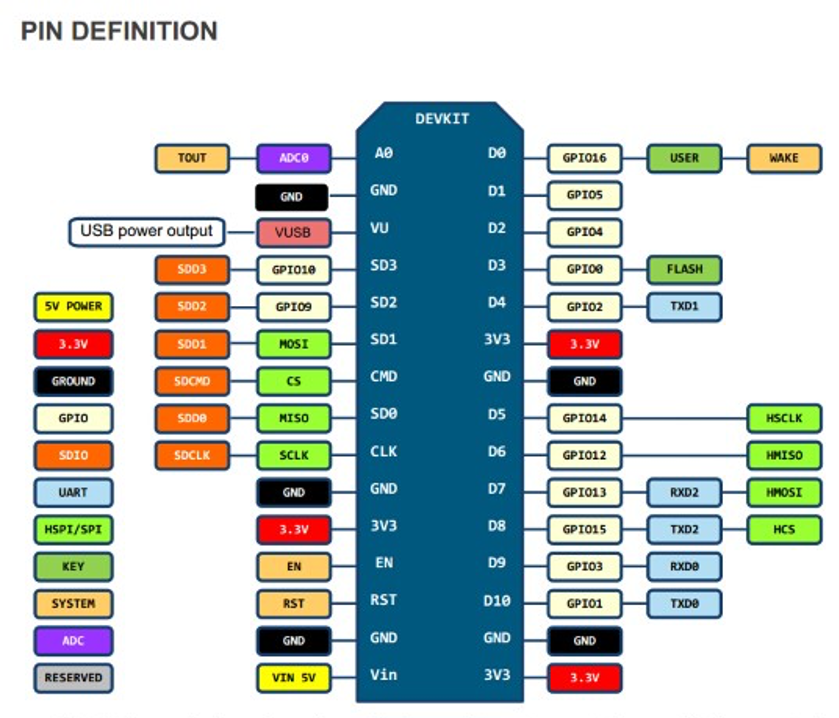

Ada beberapa jenis development board NodeMCU yang umum di jual di pasaran, yaitu jenis Amica dan Lolin. Yang membedakan diantara keduanya hanya pada ukuran dan urutan nomor dari GPIO pin  nya.

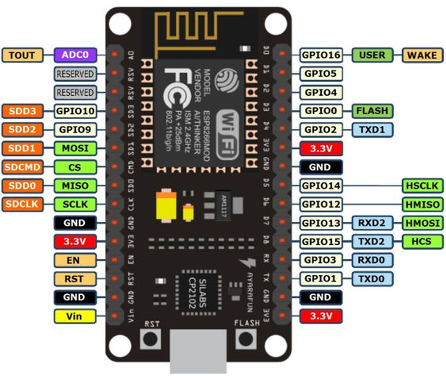

NodeMCU versi Lolin

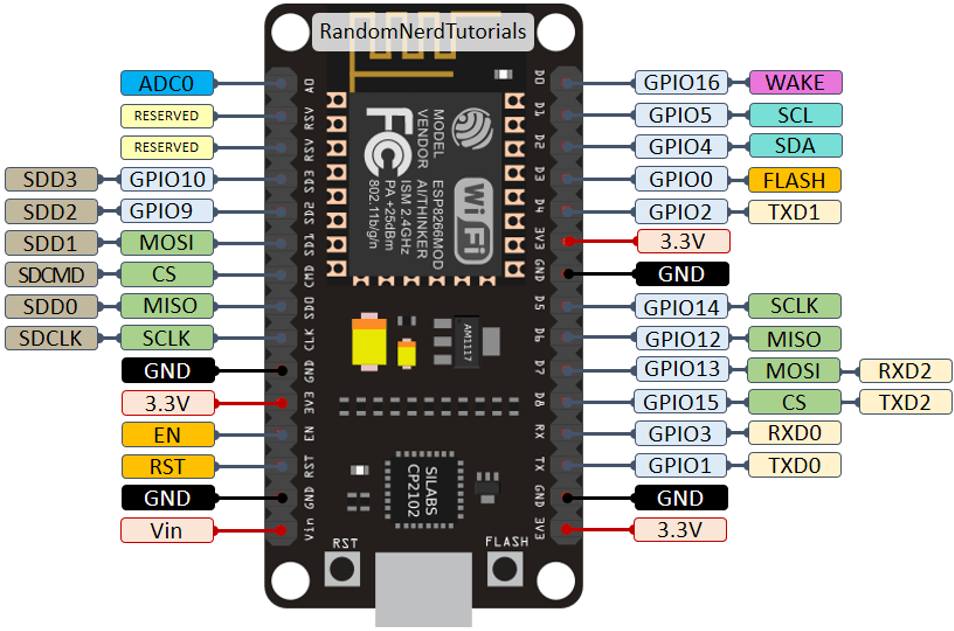

NodeMCU versi AMICA 

## Praktikum
### Project 1 Blink LED on-board
Pada project awal ini akan dilakukan percobaan untuk bagaimana menyalakan LED on-board, siapkan beberapa komponen yang dibutuhkan dan rangkailah komponen tersebut pada project board. 

Hardware Preparation:
+ NodeMCU x 1
+ Micro USB cable x 1
+ PC/laptop x 1
+ Software Arduino IDE

#### Testing Program Blink LED
Pada pertemuan 3 telah dilakukan instalasi IDE Arduino serta board modul NodeMCU, untuk memastikan bahwa instalasi telah sempurna dan semuanya berjalan dengan baik, selanjutnya perlu dilakukan tes program sederhana yaitu Blink LED. Berikut ini langkah-langkah untuk menjalankan Blink LED:
1. Pilih Board NodeMCU dengan klik menu Tools -> Board -> NodeMCU 1.0 (ESP-12E Module)

    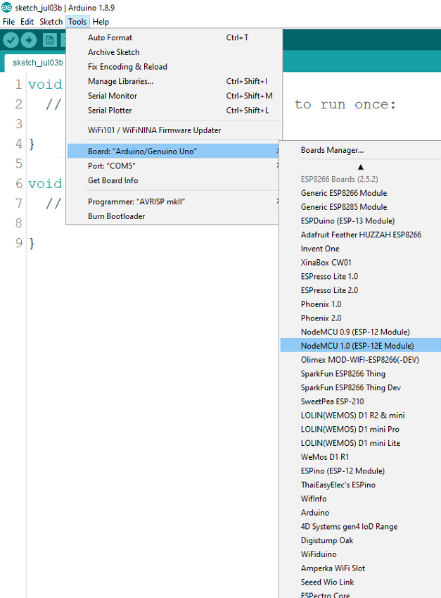
    
2. Kemudian buka menu File -> Examples -> ESP8266 -> Blink atau copy sketch program berikut :
    
    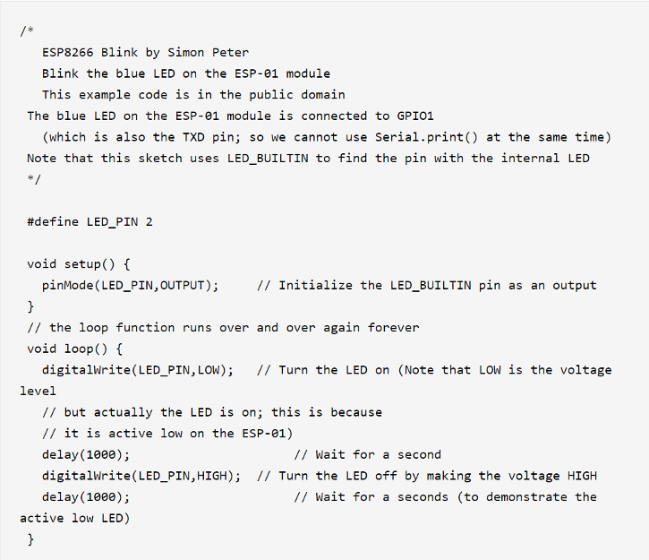
    
3. Upload Sketch program diatas ke board NodeMCU    
4. Segera setelah proses compile dan upload selesai, LED internal pada board NodeMCU akan berkedip nyala dan mati dengan jeda waktu 1 detik

### Project 2 Blink External LED
Pada project kedua ini akan dilakukan percobaan untuk bagaimana menyalakan LED external, siapkan beberapa komponen yang dibutuhkan dan rangkailah komponen tersebut pada project board.

Hardware Preparation:
+ NodeMCU x 1
+ LED x 1
+ Kable Dupont (male to male)
+ Micro USB cable x 1
+ PC/laptop x 1
+ Software Arduino IDE

1. Rangkailah komponen-komponen yang diperlukan seperti pada gambar berikut

    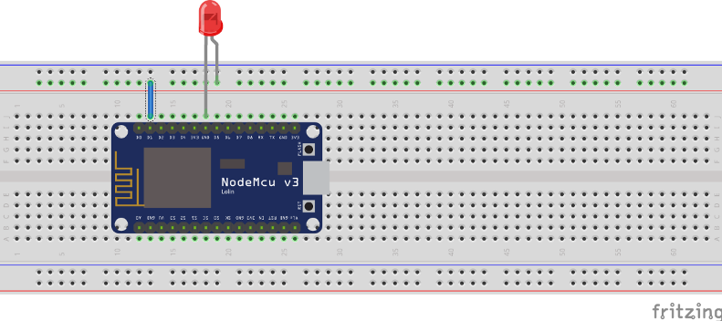
    
2. Selanjutnya tuliskan kode program berikut pada IDE Arduino

    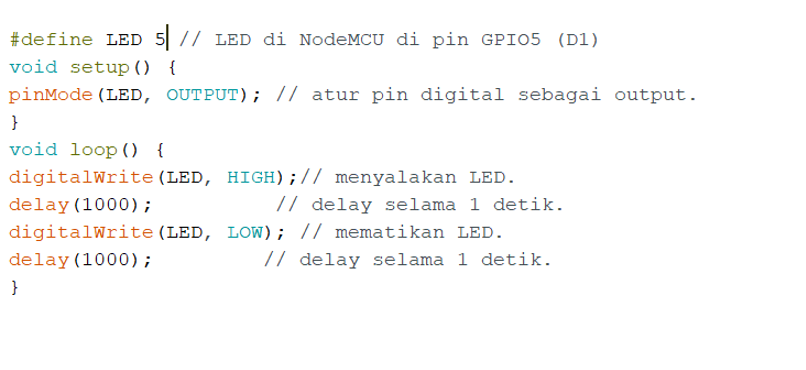
    
3. Upload Sketch program diatas ke board NodeMCU
4. Segera setelah proses compile dan upload selesai, LED pada rangkaian project board akan berkedip nyala dan mati dengan jeda waktu 1 detik

### Project 3 Running LED
Pada project ketiga ini akan dilakukan percobaan untuk menyalakan lebih dari satu LED secara teratur dan berurutan (running lED), siapkan beberapa komponen yang dibutuhkan dan rangkailah komponen tersebut pada project board.

Hardware Preparation:
+ NodeMCU x 1
+ LED x 3
+ 220 ohm resistor x 3
+ Kable Dupont (male to male)
+ Micro USB cable x 1
+ PC/laptop x 1
+ Software Arduino IDE

1. Rangkailah komponen-komponen yang diperlukan seperti pada gambar berikut

    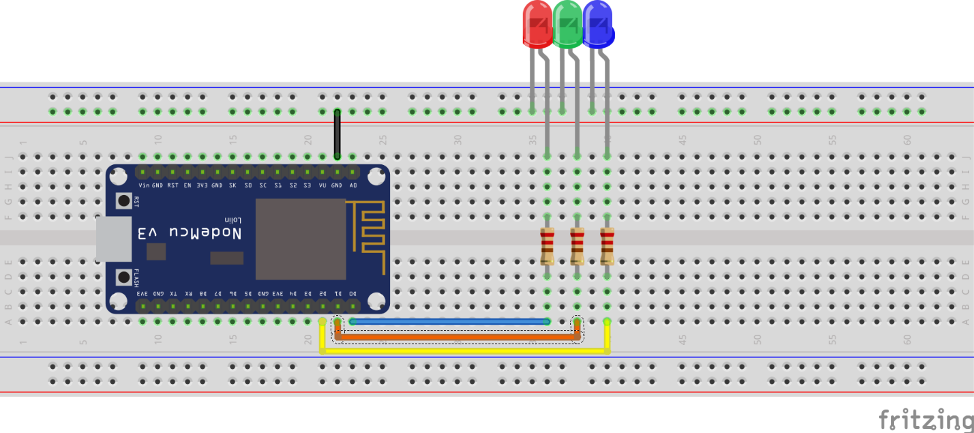
    
2. Selanjutnya tuliskan kode program berikut pada IDE Arduino

    ```cpp
   #define LedMerah 16 //D0 pin led merah 
   #define LedHijau 5 //D1 pin led hijau 
   #define LedBiru 4 //D2 pin led biru
   
   void setup() {
   Serial.begin(9600); 
   pinMode(LedMerah, OUTPUT);
   pinMode(LedHijau, OUTPUT); 
   pinMode(LedBiru, OUTPUT); // atur pin digital sebagai output.
   }
   
   void RunningLED() { 
     digitalWrite(LedMerah, HIGH); 
     digitalWrite(LedHijau, LOW); 
     digitalWrite(LedBiru, LOW); 
     Serial.println("LED Merah nyala"); 
     delay(1000); 
     
     digitalWrite(LedMerah, LOW); 
     digitalWrite(LedHijau, HIGH); 
     digitalWrite(LedBiru, LOW); 
     Serial.println("LED Hijau nyala"); 
     delay(1000); 
     
     digitalWrite(LedMerah, LOW); 
     digitalWrite(LedHijau, LOW); 
     digitalWrite(LedBiru, HIGH); 
     Serial.println("LED Biru nyala"); 
     delay(1000);
   
     Serial.println();
   }
   
   void loop() {
   LEDBerjalan();
   }
    ```
   
3. Upload Sketch program diatas ke board NodeMCU
4. Segera setelah proses compile dan upload selesai, LED pada rangkaian project board akan menyala secara berurutan dengan jeda waktu 1 detik

### Project 4 SOS LED
Pada project ketiga ini akan dilakukan percobaan untuk menyalakan lebih dari satu LED secara teratur sesuai sandi morse SOS, siapkan beberapa komponen yang dibutuhkan dan rangkailah komponen tersebut pada project board.
Hardware Preparation:
•	NodeMCU x 1
•	LED x 2
•	220 ohm resistor x 1
•	Kable Dupont (male to male)
•	Micro USB cable x 1
•	PC/laptop x 1
•	Software Arduino IDE

1. Rangkailah komponen-komponen yang diperlukan seperti pada gambar berikut

    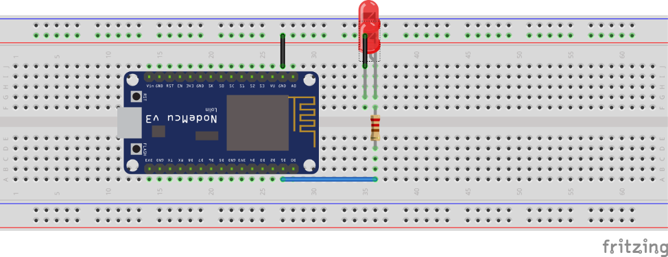
    
2. Selanjutnya tuliskan kode program berikut pada IDE Arduino

    ```cpp
   #define ledPin 5 //D1 pin LED
    
   void setup()
   {
     // atur pin digital sebagai output
     pinMode(ledPin, OUTPUT);
   }
   
   void loop()
   {
     // 3 dits (3 titik atau huruf S)
     for (int x=0; x<3; x++) {
       digitalWrite(ledPin, HIGH); // LED nyala
       delay(150); // delay selama 150ms
       digitalWrite(ledPin, LOW); // LED mati
       delay(100); // delay selama 150ms
     }
     delay(100);
   
     // 3 dahs (3 garis atau huruf O)
     for (int x=0; x<3; x++) {
       digitalWrite(ledPin, HIGH); // LED nyala
       delay(400); // delay selama 400ms
       digitalWrite(ledPin, LOW); // LED mati
       delay(100); // delay selama 100ms
     }
   
     // 100ms delay to cause slight gap between letters
     delay(100);
      // 3 dits again (3 titik atau huruf S)
     for (int x=0; x<3; x++) {
       digitalWrite(ledPin, HIGH); // LED nyala
       delay(150); // delay selama 150ms
       digitalWrite(ledPin, LOW); // LED mati
       delay(100); // delay selama 100ms
     }
   
     // wait 5 seconds before repeating the SOS signal
     delay(5000);
   }
    ```
   
3. Upload Sketch program diatas ke board NodeMCU
4. Segera setelah proses compile dan upload selesai, LED pada rangkaian project board akan menyala secara berurutan dengan jeda waktu 1 detik

## Tugas
+ Buatlah sebuah skematik miniatur pengatur lampu lalu lintas memanfaatkan dari LED yang telah kelompok Anda miliki
+ Buatlah kode sederahan untuk menjalankan miniatur pengatur lampu lalu lintas tersebut
