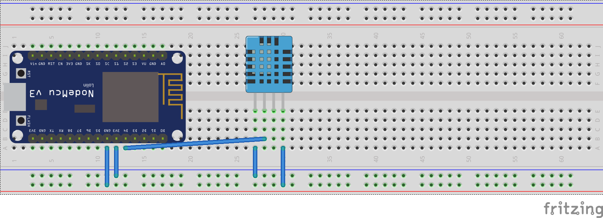

# PRAKTIKUM MATA KULIAH INTERNET OF THINGS MINGGU KE-5 (Sensor Suhu dan Kelembaban)

Semester Genap 2019/2020

Jurusan Teknologi Informasi

Politeknik Negeri Malang

## Sensor Suhu dan Kelembaban

Salah satu sensor diantara sensor-sensor yang lain adalah sensor suhu dan kelembaban. Sensor ini digunakan untuk mengambil data suhu pada lingkungan tertentu beserta tingkat kelembabannya. Salah satu sensor tersebut yang banyak digunakan adalah DHT11 karena secara biaya sangat minim serta mudah digunakan.

**Spesifikasi sensor DHT11**

| Tegangan | 3,5 V - 5,5 V|
|-|-|
| Arus | 0,3 mA|
| Jangkauan Suhu | 0-50 derajat Celsius|
| Jangkauan Kelembaban | 20%-90% |
| Akurasi Pengukuran | +- 1 derajat Celsius (Suhu) |
| | +- 1% (Kelembaban)|

Struktur pin pada sensor DHT11 seperti berikut.


## Praktikum 1 - Membaca data suhu dan kelembaban udara

Pada praktikum pertama, anda akan melakukan percobaan untuk menangkap data suhu dan kelembaban udara dengan sensor DHT11.

Susunan rangkaian sederhana pada praktikum ini seperti gambar berikut.



Contoh source code untuk membaca suhu dan kelembaban udara.

```c++
#include <dht.h>

int sensorSuhu = 13; //sesuaikan dengan GPIO pin yang anda gunakan
dht DHT;
 
void setup() {
  Serial.begin(115200);
  Serial.println("Praktikum sensor suhu dan kelembaban");
  delay(500);
}
 
void loop() {
  DHT.read11(sensorSuhu);
  Serial.print("Kelembaban udara = ");
  Serial.print(DHT.humidity);
  Serial.print("% ");
  Serial.print("Suhu = ");
  Serial.print(DHT.temperature); 
  Serial.println(" C ");
  delay(3000);
}
```

> Catatan: Pastikan anda telah mengimport [library](https://drive.google.com/open?id=1ARdy8b91dfwb7-I9G2_pvRFyKK1LW4w9) sensor DHT11 pada ArduinoIDE

Setelah source code diupload, buka serial monitor pada ArduinoIDE untuk melihat hasil pembacaan data suhu dan kelembaban udara.

## Tugas
1. Modifikasi baris kode pada bagian praktikum sehingga muncul data suhu dalam satuan celcius dan fahrenheit!
2. Buatlah simulasi sebuah alat pembaca suhu dan kelembaban udara di tengah kota dengan memanfaatkan lampu LED sebagai indikator dengan disertai keterangan data suhu dan kelembaban yang ditampilkan pada serial monitor!

    Contoh: Suhu pada sebuah kota dikategorikan sangat dingin, dingin, sejuk, normal, panas, sangat panas. Masing-masing kategori memiliki indikator lampu LED yang menyala, salah satunya ketika kategori sangat panas, maka 2 lampu LED warna merah menyala.