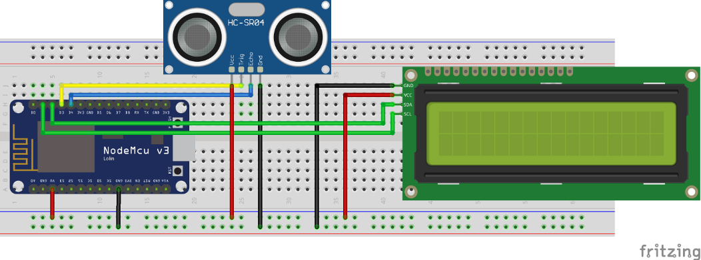

# Programming Implementation On NodeMCU Ultrasonic Sensor HC-SR04

## Tujuan
- Mampu memahami cara kerja sensor ultrasonic
- Mampu memahami bagaimana cara menghitung jarak antara benda penghalang dan sensor ultrasonic berdasarkan signal gelombang yang dikirim dan diterima
- Mampu membuat program perhitungan jarak antara benda penghalang dan sensor dalam satuan cm dan inch yang ditampilkan ke layar LCD I2C

## Capaian
- Menjelaskan proses perhitungan jarak berdasarkan gelombang dikirim dan diterima
- Menampilkan jarak antara benda penghalang dengan ultrasonic ke layar LCD I2C dalam satuan cm dan inch

## Teori Singkat

### Ultrasonic Sensor HC-SR04
Sensor ultrasonik merupakan sensor yang berfungsi untuk mendeteksi suatu benda dengan jarak tertentu sesuai dengan jenis sensornya. Pada praktikum kali ini dibahas mengenai cara menggunakan serta implemetasi sensor ultrasonik pada NodeMCU. Sensor ultrasonik yang digunakan adalah tipe HC-SR04 dengan jarak yang dapat untuk mendeteksi benda dengan akurasi 3 mm. Sensor ini memiliki pin Trigger, dimana pin ini berfungsi sebagai pengirim sinyal dan pin Echo yang berfungsi sebagai penerima sinyal yang didapat dari pantulan benda. 

Sensor ultrasonik ialah sensor yang mempunyai kemampuan untuk mengubah besaran fisis yaitu bunyi kedalam besaran listrik, begitu juga sebaliknya. Sensor ini bekerja berdasarkan perhitungan dari pantulan suatu gelombang ultrasonik sehingga jarak suatu benda dapat diketahui. Nilai gelombang ultrasonik mencapai 20.000 Hz yang tidak bisa didengar oleh telinga manusia karena sangat tinggi dan hanya bisa didengar oleh hewan-hewan tertentu seperti anjing, kucing, atau kelelawar.

Pada sensor ultrasonik tersusun atas rangkaian transmitter sebagai pemancar gelombang ultrasonik  dan rangkaian receiver sebagai penerima gelombang ultrasonik. Transmitter sensor akan memancarkan sinyal ultrasonik dan saat sinyal ultrasonik mengenai sebuah penghalang, maka sinyal ultrasonik akan dipantulkan. Sinyal ultrasonik yang dipantulkan akan diterima oleh receiver sensor. Mikrokontroller digunakan untuk mengolah dan menghitung sinyal yang diterima oleh rangkaian receiver sensor sehingga jarak sensor terhadap benda di depannya atau bidang pantul dapat diketahui. Agar lebih jelas perhatikan ilustrasi dibawah ini.


Sinyal ultrasonik yang dipancarkan tersebut akan merambat sebagai sinyal atau gelombang bunyi dengan kecepatan bunyi yang berkisar 340 m/s. Dengan demikian, untuk menentukan jarak benda dengan pantulan dapat ditentukan dengan menggunakan rumus:

```S = 340.t/2```

dimana, 		
`S` adalah jarak antara sensor ultrasonik dengan bidang pantul

`t` adalah selisih waktu antara pemancaran gelombang ultrasonik sampai diterima kembali oleh bagian penerima/receiver sensor ultrasonic

Penggunaan Sensor Ultrasonik meliputi berbagai bidang, seperti :

Dunia Kesehatan: 
- Mendeteksi organ-organ dan penyakit dalam tubuh manusia dengan USG

Dunia Industri:
- Mendeteksi suatu objek dalam proses produksi barang
- Mendeteksi keberadaan mineral dan bahan-bahan tambang.

Dunia Robotika:
- Sebagai pengganti indra pada robot untuk mengetahui jarak.

Dunia Maritim: 
- Sebagai Radar


Sensor Ultrasonic HC-SR04

### Project 1 Menampilkan pada Serial Monitor
Pada project awal ini akan dilakukan percobaan untuk bagaimana menerapakan atau mengimplementasikan pembacaan sensor ultrasonic untuk kemudian ditampilkan pada serial monitor yang ada pada IDE Arduino, siapkan beberapa komponen yang dibutuhkan dan rangkailah komponen tersebut pada project board. 

**Hardware Preparation:**
+ NodeMCU
+ Micro USB cable
+ PC/laptop
+ Software Arduino IDE
+ Kabel jumper
+ Sensor Ultrasonik HC-SR04

**Rangkaian**


Sensor Ultrasonik HC-SR04
- `Pin Trigger` dihubungkan ke pin `D3` NodeMCU
- `Pin Echo` dihubungkan ke pin `D4` NodeMCU
- `VCC` dihubungkan ke `VU` NodeMCU
- `GND` dihubungkan ke `GND` NodeMCU

**Syntax Program**

```c++

#define triggerPin D3
#define echoPin D4

void setup() {
    Serial.begin (9600);
    pinMode(triggerPin, OUTPUT);
    pinMode(echoPin, INPUT);
    pinMode(BUILTIN_LED, OUTPUT);
}

void loop() {
    long duration, jarak;
    digitalWrite(triggerPin, LOW);
    delayMicroseconds(2);
    digitalWrite(triggerPin, HIGH);
    delayMicroseconds(10);
    digitalWrite(triggerPin, LOW);
    duration = pulseIn(echoPin, HIGH);
    jarak = (duration/2) / 29.1;
    Serial.print(jarak);
    Serial.println(" cm");
    delay(1000);
}
```

Coba tempatkan benda di depan sensor ultrasonik, maka akan tampil hasil jaraknya.

### Project 2 Menampilkan pada LCD I2C
Pada project kedua ini akan dilakukan percobaan untuk bagaimana menampilkan hasil keluaran dari sensor ultrasonik pada Layar LCD I2C secara *realtime*, siapkan beberapa komponen yang dibutuhkan dan rangkailah komponen tersebut pada project board.

**Hardware Preparation:**
1. NodeMCU
2. Micro USB cable
3. PC/laptop
4. Software Arduino IDE
5. Kabel jumper
6. Sensor Ultrasonik HC-SR04
7. LCD I2C

**Rangkaian:**

Rangkailah komponen-komponen yang diperlukan seperti pada gambar berikut



**Source code**

```c++
#include <Wire.h>
#include <LiquidCrystal_I2C.h>
LiquidCrystal_I2C lcd(0x27, 16, 2); //atau 0x3F

#define triggerPin D3
#define echoPin D4

void setup() {
    lcd.begin();
    pinMode(triggerPin, OUTPUT);
    pinMode(echoPin, INPUT);
    pinMode(BUILTIN_LED, OUTPUT);
}

void loop() {
    lcd.clear();
    long duration, jarak;
    digitalWrite(triggerPin, LOW);
    delayMicroseconds(2);
    digitalWrite(triggerPin, HIGH);
    delayMicroseconds(10);
    digitalWrite(triggerPin, LOW);
    duration = pulseIn(echoPin, HIGH);
    jarak = (duration/2) / 29.1;
    lcd.setCursor(0,0);
    lcd.print("Jarak : ");
    lcd.print(jarak);
    lcd.print(" cm");
    delay(1000);
}
```

### Tugas
1. Buat rancangan dengan fritzing dengan mengembangkan rangkaian pada **praktikum kedua**. Rancangan tersebut adalah tentang simulasi sensor parkir pada sebuah mobil dengan ketentuan berikut:
    - LED Merah menyala berkedip jika jarak yang terbaca 0-1 cm
    - LED Kuning menyala berkedip jika jarak yang terbaca 1-3 cm
    - LED Hijau menyala berkedip jika jarak yang terbaca  lebih dari 3 cm
    - Jarak objek muncul pada layar LCD